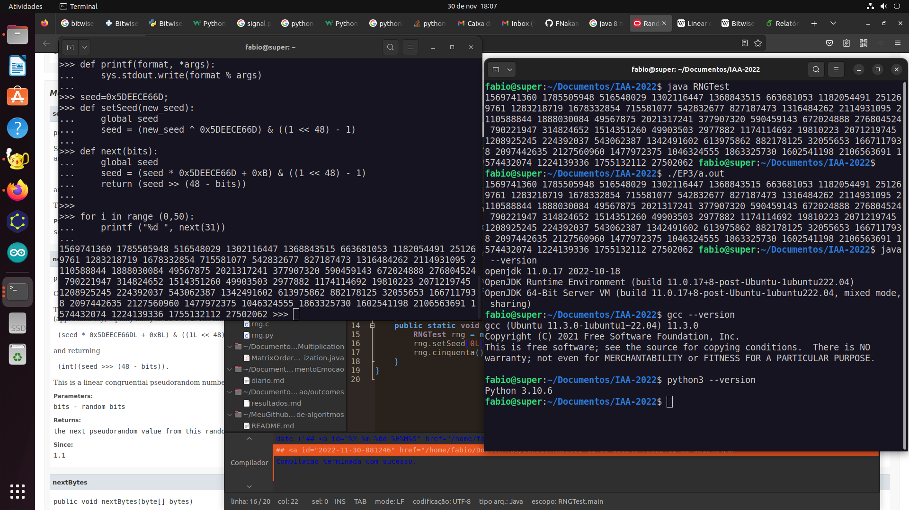

# RNG para gerar arrays longos e padronizados para testar algoritmos de busca e ordenação

Captura de tela mostrando à esquerda terminal com execução do código `rng.py`, à direita terminal com execução de instância da classe Random de OpenJDK 11, seguida de execução de `rng.c`, seguida das versões de JDK, GCC e Python no sistema de teste. Nos testes, parte-se da mesma semente e são gerados 50 números. Os números gerados são iguais, o que indica, com alta probabilidade, que os geradores são iguais.

Baseei-me no RNG documentado em Java 8: https://docs.oracle.com/javase/8/docs/api/java/util/Random.html. Portei as funções `setSeed` e `next` para C e para Python.

É um gerador linear congruencial (LCG) (https://en.wikipedia.org/wiki/Linear_congruential_generator). A semente tem 64 bits. Os números gerados podem ter no máximo 48 bits. É importante usar os tipos de dados certos para obter o resultado esperado. Por exemplo, **pode** haver diferenças em função da arquitetura (ex.: usar um sistema de 64 bits ou um sistema de 32 bits), ou se usar um compilador que gera código para 32 bits. O sistema e o compilador que testei são 64 bits.

O cálculo é feito usando operações bit-a-bit. Referência para Python: https://realpython.com/python-bitwise-operators/#integers-in-python, Referência para C: https://en.wikipedia.org/wiki/Bitwise_operations_in_C

Entre implementações de compiladores C e interpretadores Python pode haver alguma diferença no uso e interpretação de notações. Por exemplo, no uso do código em C, eu usei GCC e um colaborador usava algum outro compilador (em Windows). Havia diferença no uso dos sufixos `L` e `LL`. Isto fazia que os executáveis não fizessem as mesmas contas, logo, os geradores não eram iguais (o que era o esperado). No caso de Python, que não tem tipagem forte, **pode** ocorrer conversões de tipo de dados, o que, possivelmente, mudaria o resultado da conta.

A pasta `Python` contém o rng portado para Python, a pasta `C` contém o rng portado para C e a pasta Java contém o mesmo teste com a classe `Random` da particular implementação (OpenJDK 11).

Para executar o código Python: a) Abrir o REPL; b) Copiar o código e colar no REPL.

Para compilar e executar o código Java: a) Baixar o arquivo `RNGTest.java`; b) Compilar com `javac RNGTest.java`; c) Executar com `java RNGTest`.

Para compilar e executar o código C: a) Baixar o arquivo `rng.c`; b) Compilar com `gcc rng.c`; c) Executar com `./a.out`.

## Referências para uso do Git/Github:
https://tableless.com.br/tudo-que-voce-queria-saber-sobre-git-e-github-mas-tinha-vergonha-de-perguntar/
https://www.theserverside.com/video/Git-vs-GitHub-What-is-the-difference-between-them

**nota**: Usei este repositório para testar funcionalidades do Git e do GitHub. Em 2022 remodelei para manter implementações de geradores de números (pseudo-)aleatórios que uso em um exercício.
